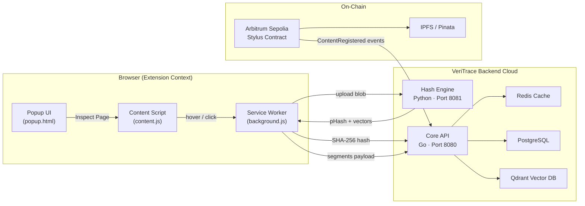
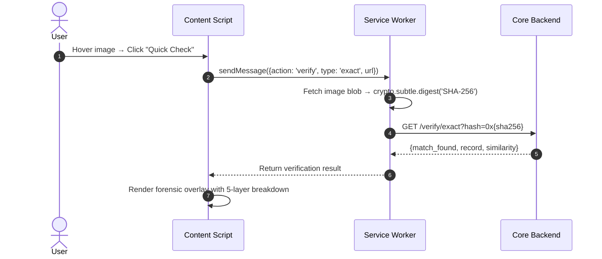
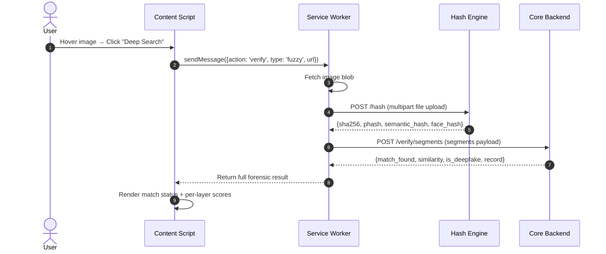

# VeriTrace Lens — Browser Extension

> **Instant on-page provenance verification for every image and video on the web.**
> Powered by Arbitrum Stylus, IPFS, and a 5-layer forensic hashing pipeline.

---

## The Problem

Integrating decentralized ledgers (like blockchain) into high-performance web applications is inherently slow and complex:

| Challenge | Impact |
| :--- | :--- |
| **Latency** | Direct on-chain calls (EVM lookups) take **seconds** to resolve — unacceptable for real-time applications or browser extensions checking hundreds of images on a page. |
| **Complex Querying** | Blockchains only support **exact-key matches**. They do not support fuzzy text searches, visual perceptual searches, or vector similarity lookups. |
| **Data Retrieval Overhead** | Content metadata (author info, creation tools, verification timestamps) stored on IPFS requires **multi-second fetches** over HTTP gateways, leading to poor user experience. |

---

## Solution Architecture

The VeriTrace Core Backend acts as a **high-speed off-chain synchronization and caching layer** that bridges Web3 immutability with Web2 responsiveness:

### 1. EVM Event Syncing
A background event listener runs continuously, filtering events emitted by the Arbitrum Sepolia contract. When it detects a `ContentRegistered` event, it automatically:
- Downloads the corresponding JSON metadata from IPFS
- Parses the content record
- Writes it to a high-speed local database

### 2. Hierarchical Caching
Incoming exact-match verification requests follow a **tiered lookup strategy**:
```
Request → Redis Cache (L1) → PostgreSQL (L2) → Cache Update
```
- **Cache Hit**: Sub-10ms response from Redis
- **Cache Miss**: Fallback to Postgres relational query, then update Redis for subsequent lookups

### 3. Perceptual Vector Matching
Perceptual hashes are split into multi-dimensional float arrays and indexed in **Qdrant Vector DB**:
- Performs **KNN (K-Nearest Neighbor)** lookups using Manhattan / L1 distance
- Locates visually modified versions of original assets in **milliseconds**
- Threshold-based scoring (distance ≤ 10 → match) with similarity percentage output

### 4. Segment-Based Video Alignment
For documents and videos, the backend processes arrays of keyframe signatures:
- Executes custom algorithms to locate matching sections across timelines
- Calculates **overall edit similarity** between source and query media
- Returns matched segment count and frame-level forensic breakdown

---

## Extension Architecture



---

## How It Works

### On-Page Hover Verification
1. **Content script** injects into every page at `document_idle`
2. Detects `` and `<video>` elements (ignoring icons < 100×100px)
3. Renders a **floating VeriTrace button** on the top-right corner of each media element
4. User clicks the button → opens a contextual action menu

### Verification Modes

| Mode | Trigger | What Happens |
| :--- | :--- | :--- |
| **⚡ Quick Check** (Exact) | Click "Quick Check" | Computes SHA-256 client-side via `crypto.subtle.digest()` → queries `/verify/exact` endpoint |
| **🔍 Deep Search** (Fuzzy) | Click "Deep Search" | Uploads blob to Hash Engine → receives pHash + semantic vectors → queries `/verify/segments` with full forensic payload |
| **🎥 Video Recording** | Click "Start Recording" | Captures video stream frames via `MediaRecorder` + canvas sampling → sends representative keyframe to backend |

### 5-Layer Forensic Signal Matrix
Every verification extracts and displays 5 independent forensic layers:

| Layer | Signal | Description |
| :--- | :--- | :--- |
| **L1** | SHA-256 | Cryptographic byte-level hash — exact file identity |
| **L2** | Perceptual pHash | 64-bit visual structural fingerprint — survives crops, resizes, compression |
| **L3** | Semantic Embeddings | 64-dimensional AI vector — captures scene meaning and composition |
| **L4** | Facial Geometry | 128D dlib landmark mesh — biometric face topology |
| **L5** | Audio Chroma | MFCC acoustic spectrum — temporal audio fingerprint |

---

## File Structure

```text
veritrace-extension/
├── manifest.json          # Chrome MV3 manifest — permissions, content scripts, service worker
├── icons/
│   ├── icon16.png         # Toolbar icon (16×16)
│   ├── icon48.png         # Extension management icon (48×48)
│   └── icon128.png        # Chrome Web Store icon (128×128)
└── src/
    ├── background.js      # Service worker — handles SHA-256 hashing, API calls, tab capture
    ├── content.js         # Injected script — hover detection, UI rendering, video recording
    ├── content.css        # Overlay styling — buttons, tooltips, forensic layer cards
    ├── popup.html         # Extension popup — status display, action buttons, history log
    └── popup.js           # Popup logic — scan triggers, navigation, toggle state
```

---

## API Endpoints Used

| Endpoint | Method | Purpose |
| :--- | :--- | :--- |
| `api.veritrace.dpkvtrading.online/api/v1/verify/exact` | `GET` | Exact SHA-256 match lookup (Redis → Postgres) |
| `api.veritrace.dpkvtrading.online/api/v1/verify/segments` | `POST` | Multi-layer fuzzy + segment match (Qdrant KNN) |
| `api.hash.veritrace.dpkvtrading.online/api/v1/hash` | `POST` | Compute pHash, semantic embeddings, face mesh from uploaded blob |

---

## System Flow Diagrams

### Exact Verification (Quick Check)



### Fuzzy Verification (Deep Search)



---

## Installation

### Developer Mode (Unpacked)
1. Clone the repository:
   ```bash
   git clone https://github.com/your-org/veritrace-extension.git
   ```
2. Open Chrome → navigate to `chrome://extensions`
3. Enable **Developer mode** (toggle in top-right)
4. Click **Load unpacked** → select the `veritrace-extension/` directory
5. The VeriTrace shield icon appears in the toolbar

### Permissions Required
| Permission | Reason |
| :--- | :--- |
| `activeTab` | Capture visible tab screenshots for video frame fallback |
| `storage` | Persist verification history locally (last 20 inspections) |
| `<all_urls>` (host) | Inject content script on any page to detect media elements |

---

## Configuration

API base URLs are defined at the top of [background.js](src/background.js):

```javascript
const CORE_API = 'https://api.veritrace.dpkvtrading.online';
const HASH_API = 'https://api.hash.veritrace.dpkvtrading.online';
```

To point at a local development stack:
```javascript
const CORE_API = 'http://localhost:8080';
const HASH_API = 'http://localhost:8081';
```

---

## Related Repositories

| Component | Stack | Description |
| :--- | :--- | :--- |
| **veritrace-backend** | Go · Gin · Postgres · Redis · Qdrant | Core API engine — event syncing, caching, vector search |
| **Veritrace-hash-engine-backend** | Go | Perceptual hash computation and keyframe extraction |
| **veritrace-ai-service** | Python · FastAPI | AI embedding generation (semantic vectors, face mesh) |
| **contract** | Rust · Arbitrum Stylus | On-chain content registry smart contract |
| **veritrace-frontend** | React · Vite | Web application for registration and verification |
| **veritrace-extension** | Vanilla JS · Chrome MV3 | ← *You are here* |

---

## License

MIT
